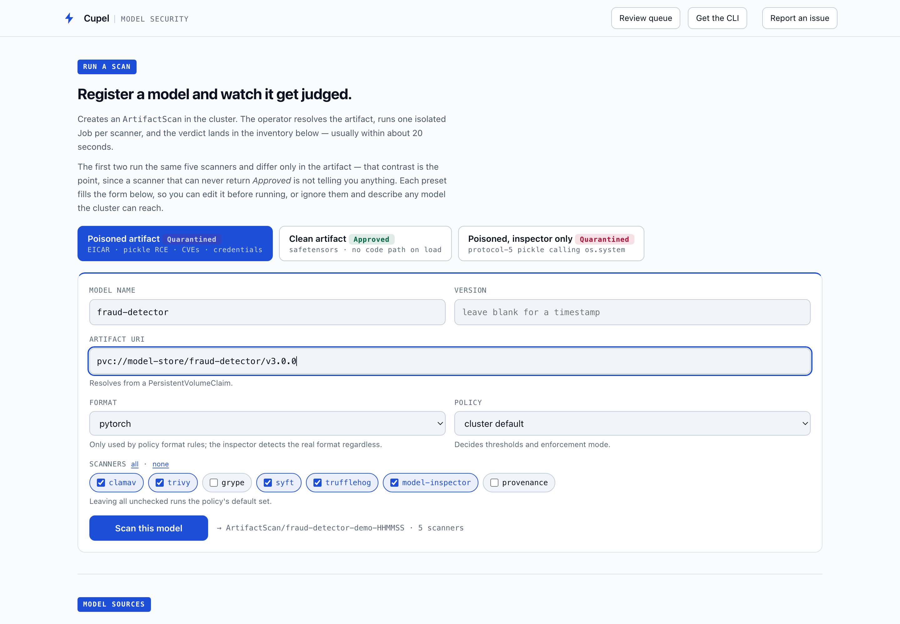
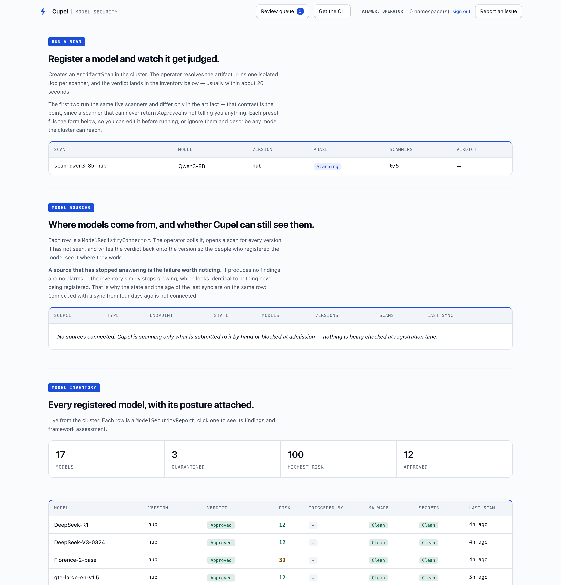
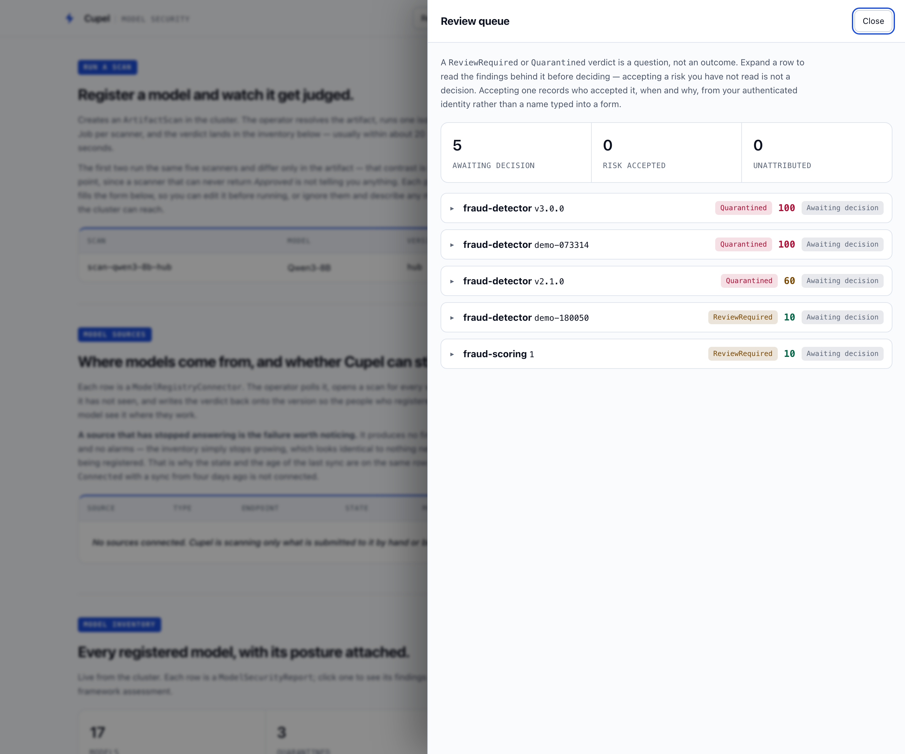
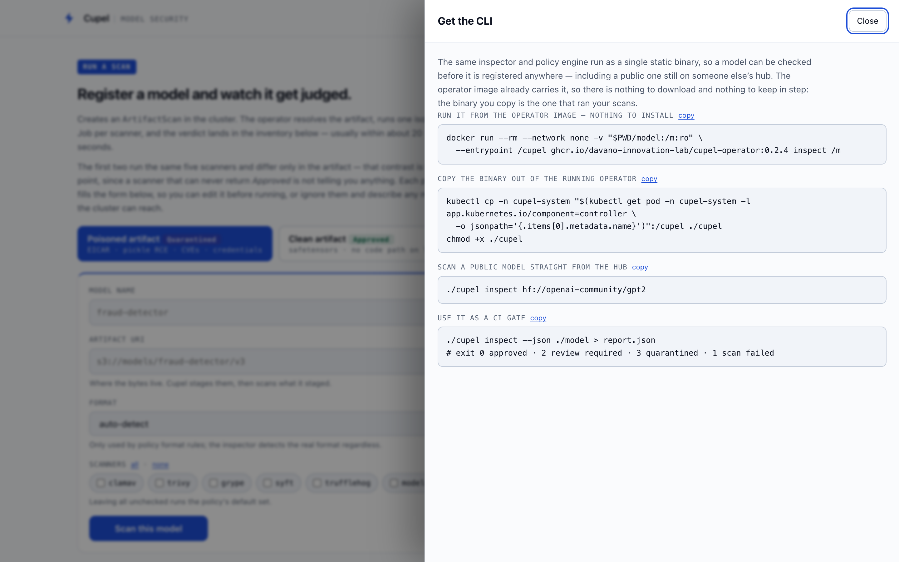

# The console

A single self-contained page. It talks to the cluster API, so what it shows is
whatever the CRDs currently say — there is no separate database to fall out of
step.

**How it is served.** `cupel-api` authenticates every request and returns only
what the signed-in subject may see. Findings a role may not have are removed
before the response is serialized — not hidden with CSS — so anything the page
can display, it was already allowed to have.

It refuses to start without an OIDC issuer and a role-bindings file. Both
refusals are deliberate: a console that serves exploit paths to whoever reaches
the port is worse than no console, and a permissive default for bindings would
hand every finding to every authenticated user.

```bash
cupel-api \
  --oidc-issuer-url https://sso.example.com \
  --oidc-client-id cupel \
  --oidc-redirect-url https://cupel.example/auth/callback \
  --bindings /config/bindings.yaml \
  --tls-cert-file /tls/tls.crt --tls-private-key-file /tls/tls.key
```

## Who sees what

| Role | Sees |
|---|---|
| `viewer` | A model exists and what it was judged to be. Nothing about why. |
| `auditor` | Findings and compliance, but never the exploit path — no file locations, no descriptions. Enough to audit, not enough to attack. |
| `owner` | Full finding detail and can start scans, for their own namespaces. |
| `security` | The same everywhere, plus accepting risk. |
| `admin` | Everything, including model sources and policy. |

Groups from the identity provider map to roles and tenants in a bindings file.
When a view is narrowed by your role the console says so — "3 findings your
role cannot see" — because a console that silently drops findings is
indistinguishable from one reporting a clean model.

## Starting a scan



The presets fill the form rather than firing, so you can see what a scan
request is made of before running it. The first two run the *same* five
scanners and differ only in the artifact — that contrast is deliberate, since a
scanner that can never return `Approved` is not telling you anything.

The artifact URI accepts anything the resolvers handle, and the hint under the
field names which one will take it:

| Scheme | Resolves from |
|---|---|
| `hf://owner/name` | Hugging Face, pinned to the current commit |
| `mlflow://host/path` | an MLflow tracking server's artifact proxy |
| `s3://bucket/prefix` | object storage, including ODF and MinIO |
| `oci://registry/repo:tag` | an OCI registry |
| `pvc://claim/path` | a PersistentVolumeClaim, in-cluster |
| `https://…` | a URL |

## Inventory, and how each model was scanned



Every row is a `ModelSecurityReport`. The **Triggered by** column is the part
that is easy to overlook and matters most in an audit — the same verdict means
different things depending on why the scan ran:

| Trigger | Meaning |
|---|---|
| `Registry` | a model source published this version |
| `Runtime` | a workload tried to deploy it |
| `Periodic` | a scheduled recheck, because the previous verdict had aged |
| `Manual` | somebody asked for it here |
| `Pipeline` | CI asked for it |

"Checked when it was registered" and "checked only because someone tried to
deploy it" are very different assurances. Clicking a trigger badge filters to
it, so *show me everything a deployment forced* is one click.

Stat cards, verdict pills, severity chips and scanner names all filter the same
way, and active filters appear as chips that say why the view is narrowed.

## Deciding on a verdict



A `ReviewRequired` or `Quarantined` verdict is a question, not an outcome.
The review queue lists what is waiting, and a row expands into the findings
behind its verdict — the evidence sits directly above the accept form, because
accepting a risk you have not read is not a decision.

Accepting one creates an `ArtifactException`. The reviewer supplies the reason;
the identity comes from the admission webhook, which overwrites whatever the
object claimed with the authenticated user. A signature you can type is not a
signature.

Two things the queue is careful about:

- **Not everything is waivable.** A confirmed malware detection and an embedded
  credential are not judgement calls — the row says so *before* you decide, and
  again afterwards, rather than recording an acceptance that quietly changes
  nothing.
- **An unsigned acceptance says so.** If the signing webhook is not installed,
  the record exists with no attribution. The row reads `Accepted, unsigned`, the
  approver shows as `unattributed`, and those are counted separately from real
  acceptances — a stat that lumped them together would hide the only case worth
  seeing.

## Getting the CLI



The same inspector and policy engine run as one static binary, so a model can be
checked before it is registered anywhere. The operator image already carries it,
which means there is nothing to download and nothing to keep in step: the binary
you copy out is the one that ran your scans.

```bash
cupel inspect hf://openai-community/gpt2
```

Exit codes are made for CI: `0` approved, `2` review required, `3` quarantined,
`1` the scan itself failed. A finding never exits `1` — a completed scan reports
its verdict through the verdict codes, so a pipeline can tell *blocked* from
*broken*.
